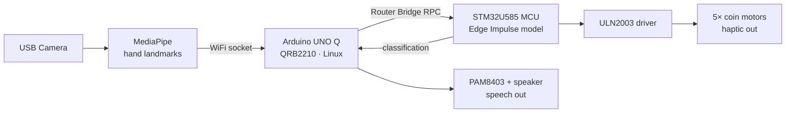

# HapticTalk

**A bidirectional communication device for the deaf, mute, and deaf-blind — built on the Arduino UNO Q.**

Sign language goes in, speech comes out. Speech goes in, vibration patterns come out on your fingertips.

Built for the [Arduino Physical AI Challenge India 2026](https://robu.in/arduino-physical-ai-challenge-india-2026/).

---

## The problem

A deaf person signing to someone who doesn't know sign language has no way through. Text works, but it's slow and requires both people to stop and type.

For someone who is **both deaf and blind**, it's worse — speech and text both fail completely. The remaining channel is touch, and there's no cheap, wearable device that uses it well.

HapticTalk addresses both directions with one device.

---

## What it does

### Direction 1 — signing → speech

A camera watches the user sign. MediaPipe extracts 21 hand landmarks per hand, and a neural network trained on Indian Sign Language classifies the gesture. A pattern matcher assembles recognised signs into natural English, which is spoken through a small amplifier and speaker.

### Direction 2 — speech → touch

Five coin vibration motors sit on the fingertips of a glove. Incoming words are encoded as vibration patterns, so a message can be **felt**. This is the channel that works when a user can neither hear nor see.

---

## Architecture



The UNO Q is a dual-brain board. The Qualcomm QRB2210 runs Linux and handles I/O and orchestration; the STM32U585 microcontroller runs the classifier and drives the motors. The two communicate over Arduino's Router Bridge RPC.

**Inference runs on-device on the STM32U585 in 8 ms.** No cloud, no internet, no API calls.

> **Current limitation:** MediaPipe landmark extraction currently runs on a host laptop, not on the QRB2210. The classifier is genuinely on-device; the perception layer is not yet. Migrating MediaPipe to the QRB2210 is the clearest next step. See [Limitations](#limitations).

---

## The haptic encoding scheme

Encoding language onto five vibration points is a real design problem. Combinatorial approaches — "motors 1, 3 and 4 together mean X" — fail in practice, because people cannot reliably distinguish simultaneous vibration across adjacent fingers. The sensations merge.

What works is **one finger at a time, distinguished by pulse length**. Short vs. long discrimination is near-perfect perceptually, and it gives a larger vocabulary space than counting pulses (people miscount past three).

### Finger → category

| Finger | Category |
|---|---|
| Thumb | Medical / urgent |
| Index | Needs |
| Middle | Identity |
| Ring | Social / meta |
| Pinky | Responses |

The most perceptually distinct fingers — thumb and pinky — carry the most time-critical vocabulary.

### Sequence → word

`S` = 100 ms pulse · `L` = 300 ms pulse · 120 ms gap between pulses

| Code | Thumb | Index | Middle | Ring | Pinky |
|---|---|---|---|---|---|
| S | PAIN | WATER | I | TODAY | YES |
| L | HELP | FOOD | NAME | GOODMORNING | NO |
| S-S | DOCTOR | THIRSTY | DEAF | UNDERSTAND | PLEASE |
| S-L | HOSPITAL | — | BLIND | COMMUNICATION | THANKYOU |
| L-S | MEDICINE | — | AI | DEMONSTRATE | SORRY |

23 words across 5 fingers, with 7 slots free for expansion. The longest pattern completes in about 720 ms.

### Envelope → intent

Layered on top of any word:

| Intent | Pattern |
|---|---|
| **Neutral** | Word at rated intensity |
| **Urgent** | Alert burst (thumb + pinky, two sharp taps), then the word at higher intensity with timings compressed to 60% |
| **Question** | Intensity ramps upward across the word, followed by a rising sweep thumb → pinky |
| **Affirmation** | Word, then a short double buzz on the same finger |

So the user feels not just *which* word, but *how it was meant*.

### Motor kick-start

Coin ERM motors need ~2.3 V to break static friction and take 30–50 ms to spin up. A short pulse at steady intensity is barely perceptible. Every pulse therefore opens at full PWM for 25 ms before dropping to its target level, so the motor is already spinning by the time the pulse registers on the skin.

---

## Model

| | |
|---|---|
| Platform | Edge Impulse |
| Classes | 23 Indian Sign Language signs |
| Input | 30-frame sequences × 126 landmark features |
| Architecture | Flatten → Dense(20) → Dense(10) |
| Training | 200 cycles, LR 0.0005, manual optimizer |
| **Test-set accuracy** | **80%** |
| Inference time | 8 ms |
| Peak RAM | 27.2 KB |
| Flash | 531.4 KB |
| Target | Cortex-M4F @ 80 MHz (STM32U585) |

**Vocabulary:** AI · BLIND · COMMUNICATION · DEAF · DEMONSTRATE · DOCTOR · FOOD · GOODMORNING · HELP · HOSPITAL · I · MEDICINE · NAME · NO · PAIN · PLEASE · SORRY · THANKYOU · THIRSTY · TODAY · UNDERSTAND · WATER · YES

The 80% figure is measured on a held-out test set the model never saw during training. Validation-set accuracy runs higher (~90%), but with 30 samples per class that number overstates real performance — the gap between the two is itself a useful signal about how much more data this model wants.

---

## Hardware

| Component | Qty | Purpose |
|---|---|---|
| Arduino UNO Q (2 GB) | 1 | QRB2210 Linux SoC + STM32U585 MCU |
| Coin vibration motor, 3 V | 5 | Fingertip haptic output |
| ULN2003 Darlington array | 1 | Motor driver (7 channels, integrated flyback diodes) |
| PAM8403 amplifier | 1 | Speech output |
| Anti-static ESD glove | 1 | Glove chassis |
| 26 AWG silicone wire | — | Motor lead extensions |
| Breadboard power supply | 1 | Isolated 5 V rail for motors |

**Motor specs:** 3.0 V rated (2.5–4.0 V operating), 90 mA running, 120 mA starting, 2.3 V start threshold, 9000 RPM.

### Wiring

| Finger | UNO Q pin | ULN2003 IN | ULN2003 OUT |
|---|---|---|---|
| Thumb | 3 | 1 | 16 |
| Index | 5 | 2 | 15 |
| Middle | 6 | 3 | 14 |
| Ring | 9 | 4 | 13 |
| Pinky | 10 | 5 | 12 |

ULN2003 **pin 8 → GND**, **pin 9 (COM) → +5 V rail**. Motor `+` leads to the +5 V rail, motor `−` leads to the outputs above.

**Power note.** The ULN2003 drops ~1 V, so a 5 V rail applies ~4.0 V at full PWM — the motors' absolute maximum. PWM intensities are capped in firmware accordingly (`INT_NEUTRAL = 190` ≈ 3.0 V). Motors are powered from a separate breadboard supply rather than the UNO Q's USB rail: five motors starting simultaneously would draw ~600 mA and brown out the board. The urgent alert burst is deliberately limited to two motors for the same reason.

---

## Repository structure

```
HapticTalk/
├── firmware/
│   └── haptic_engine.ino      Non-blocking haptic pattern engine (STM32 side)
├── host/
│   ├── mediapipe_bridge.py    Landmark extraction, streams to UNO Q
│   ├── record_signs.py        Dataset capture tool
│   ├── upload_to_ei.py        Edge Impulse dataset upload
│   └── serial_test.py         Serial link diagnostics
├── docs/
│   ├── hardware_build_guide.md
│   └── images/
└── README.md
```

---

## Getting started

### Host side

```bash
pip install -r requirements.txt
python host/mediapipe_bridge.py
```

### Firmware

1. Open `firmware/haptic_engine.ino` in the Arduino IDE
2. Verify the five motor pins in `MOTOR_PIN[]` support `analogWrite()` on your board
3. Flash to the UNO Q

### Testing the haptics standalone

The engine includes a serial interface, so patterns can be tested without the full pipeline running. Open Serial Monitor at **115200 baud**:

```
LIST                    → print the full vocabulary table
WATER                   → play a single word
PAIN URGENT             → word with urgent envelope
UNDERSTAND QUESTION     → word with question envelope
THANKYOU AFFIRM         → word with affirmation envelope
STOP                    → halt playback
```

Tune `SHORT_MS`, `LONG_MS` and `GAP_MS` until the patterns are reliably distinguishable on your own fingertips before integrating with the classifier.

---

## Limitations

Stated openly, because knowing where a system's edges are is part of the engineering.

- **MediaPipe runs on a host laptop, not on the UNO Q.** The classifier is genuinely on-device at 8 ms; landmark extraction is not. Running MediaPipe on the QRB2210's Cortex-A53 cores is expected to yield roughly 8–15 FPS, which would require rethinking the 30-frame window. This is the main item of future work.
- **8 ms is inference time, not end-to-end latency.** Camera capture, landmark extraction, network transport and haptic playback push the full loop to roughly 100–300 ms.
- **80% per-sign accuracy compounds across sentences.** An eight-sign sentence completes cleanly around 17% of the time. More training data per class is the fix.
- **The haptic code must be learned.** Patterns are not intuitive to a first-time user any more than Braille is. The design goal was learnability and discriminability, not immediate legibility.
- **Single-user dataset.** All training samples were recorded by one signer. Generalisation across users is untested.

---

## Future work

- Port MediaPipe to the QRB2210 for a fully self-contained device
- Expand the dataset with multiple signers
- Add the second glove for two-handed signs
- User study on haptic pattern learnability
- Battery power and a wireless link between glove and board

---

## Author

**Sumedh** — ECE'28 undergraduate


---

